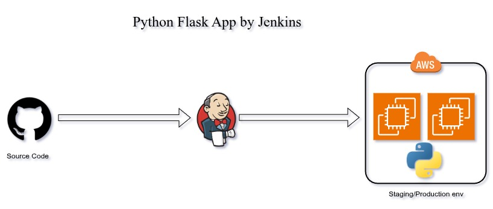

# Python Flask App by Jenkins

## Requirements
1. Launch instances on AWS or Others 
2. Need to install Package ( Python,Docker,...)
3. Configure Systemd File ( Flask App Service)
4. Configure Credentials on Jenkins
5. Configure Pipeline and Trigger